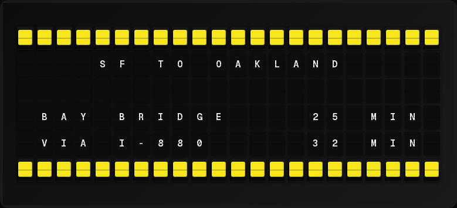

# Traffic Plugin



Display commute times and traffic conditions using Google Routes API.

**→ [Setup Guide](./docs/SETUP.md)** - API key registration and route configuration

## Overview

The Traffic plugin fetches real-time commute times from Google Routes API, showing drive times with traffic delays for multiple routes.

## Features

- Real-time drive time estimates
- Traffic delay calculations
- Multiple route monitoring (up to 4)
- Per-route travel mode: drive, bicycle, transit, walk, motorcycle
- Color-coded traffic status

> **Traffic delays are a drive-mode feature.** Google has no traffic model for
> walking, cycling or transit, so those routes always report a zero delay and
> `LIGHT` status. Their durations are real; their delay numbers are not. The
> [Setup Guide](./docs/SETUP.md#travel-modes) explains why, and what it costs.

## Quick Setup

For detailed setup instructions including API key registration, see the **[Setup Guide](./docs/SETUP.md)**.

## Template Variables

### Primary Route (First)

```
{{traffic.duration_minutes}}  # Total drive time (e.g., "25")
{{traffic.delay_minutes}}     # Delay due to traffic (e.g., "5")
{{traffic.traffic_status}}    # LIGHT, MODERATE, or HEAVY
{{traffic.traffic_color}}     # Color tile
{{traffic.destination_name}}  # Display name (e.g., "WORK")
{{traffic.formatted}}         # Pre-formatted line
{{traffic.travel_mode}}       # DRIVE, BICYCLE, TRANSIT, WALK, TWO_WHEELER
{{traffic.available}}         # Yes/No - did this route return data?
```

### Aggregates

```
{{traffic.route_count}}       # Number of routes
{{traffic.worst_delay}}       # Longest delay (minutes)
```

### Individual Routes (Array)

```
{{traffic.routes.0.destination_name}}   # First route name
{{traffic.routes.0.duration_minutes}}   # First route time
{{traffic.routes.0.delay_minutes}}      # First route delay
{{traffic.routes.0.formatted}}          # First route formatted
{{traffic.routes.0.travel_mode}}        # First route travel mode
{{traffic.routes.0.available}}          # First route reported data

{{traffic.routes.1.destination_name}}   # Second route name
{{traffic.routes.1.formatted}}          # Second route formatted
```

## Example Templates

### Single Route

```
{center}COMMUTE
{{traffic.destination_name}}
{{traffic.duration_minutes}} minutes
{{traffic.traffic_status}}
```

### Multiple Routes

```
{center}TRAFFIC
{{traffic.routes.0.formatted}}
{{traffic.routes.1.formatted}}
{{traffic.routes.2.formatted}}
```

### With Color

```
{center}COMMUTE
{{traffic.traffic_color}} {{traffic.destination_name}}
TIME: {{traffic.duration_minutes}}m
DELAY: +{{traffic.delay_minutes}}m
```

## Configuration

| Setting | Type | Required | Description |
|---------|------|----------|-------------|
| enabled | boolean | No | Enable/disable the plugin |
| api_key | string | Yes | Google Routes API key |
| routes | array | Yes | Routes to monitor (max 4) |
| refresh_seconds | integer | No | Update interval (default: 300) |

### Route Configuration

Each route requires:
- `origin`: Starting address or lat,lng
- `destination`: Ending address or lat,lng
- `destination_name`: Short name for display

And optionally:
- `travel_mode`: `DRIVE` (default), `BICYCLE`, `TRANSIT`, `WALK` or
  `TWO_WHEELER`. Omitting it keeps the old behaviour, so existing saved
  configurations are unaffected.

Routes are addressed positionally in templates, and they keep their position:
if a route returns nothing — a transit route with no service at that hour, say
— it stays at its index reporting `???` rather than sliding the routes after it
up by one.

## Traffic Status Colors

- **Green (LIGHT)**: Normal traffic
- **Yellow (MODERATE)**: 20%+ slower than normal
- **Red (HEAVY)**: 50%+ slower than normal
- **No tile (UNKNOWN)**: The route returned no data on the last refresh

Bicycle, transit and walk routes are always green — see the note under
[Features](#features).

## Costs

The Routes API is not free at the default refresh interval. Google retired its
$200/month platform credit in March 2025; a single drive route refreshed every
5 minutes now runs about **$36/month**. The
[Setup Guide](./docs/SETUP.md#costs) has the current SKU prices and a formula
for picking a refresh interval that stays inside the free allowance.

## Author

FiestaBoard Team

